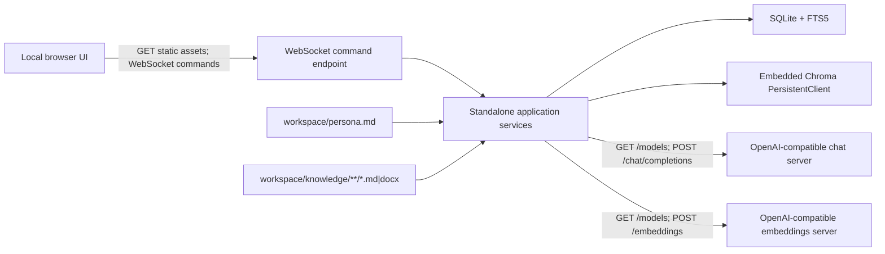

# VirtualMate Architecture and Design Decisions

## 1. Purpose

This document defines the architecture, fixed retrieval profile, runtime boundaries, storage design, WebSocket protocol, testing strategy, and phased implementation plan for the provisional **VirtualMate**.

The application borrows proven implementation ideas from Substrate but is not a Substrate application. It owns its complete runtime and portable packaging under `standalone/virtual_mate`.

## 2. Product shape

The product is a small Windows-local assistant with two surfaces:

- **Chat:** one evidence-grounded conversation surface with no attachments or model controls.
- **Administration:** model servers, two model roles, fixed workspace status, `Process knowledge`, and `Reload persona`.

There is no authentication, multi-user isolation, connector framework, capability catalog, ontology system, audit service, dataset registry, workflow engine, or distributed data plane.

## 3. Runtime architecture



The reference implementation is one Python process containing:

- a minimal FastAPI/ASGI server for GET assets, read-only bootstrap data, and one WebSocket endpoint;
- application services called directly by WebSocket command handlers;
- an embedded SQLite connection layer;
- an embedded Chroma persistent client;
- outbound `httpx` clients for OpenAI-compatible servers;
- prebuilt React assets.

## 4. Repository and portable layout

### 4.1 Source layout

```text
standalone/virtual_mate/
├─ backend/
│  └─ virtual_mate/
│     ├─ app.py
│     ├─ paths.py
│     ├─ config.py
│     ├─ websocket.py
│     ├─ models/
│     ├─ ingestion/
│     ├─ retrieval/
│     └─ chat/
├─ frontend/
├─ prompts/
├─ doc/
│  ├─ RD.md
│  └─ ADD.md
├─ tests/
│  ├─ unit/
│  ├─ integration/
│  ├─ e2e/
│  ├─ e2e_operational/
│  ├─ fixtures/
│  └─ operational_scenarios.md
├─ requirements.txt
├─ requirements-dev.txt
└─ VirtualMate.spec
```

### 4.2 Portable layout

```text
VirtualMate/
├─ VirtualMate.exe
├─ _internal/
├─ web/
├─ workspace/
│  ├─ knowledge/
│  ├─ persona.md
│  └─ corporate-ca.pem       # optional, user-provided
└─ data/
   ├─ config.json
   ├─ corpus.db
   ├─ chroma/
   └─ logs/
```

All paths are resolved from the executable/runtime root. The current working directory is never treated as the portable root.

## 5. Local transport decision

### 5.1 No browser-facing POST

The UI loads HTML, JavaScript, CSS, icons, and read-only bootstrap state with GET. Every mutation and long-running operation uses WebSocket messages. The local server exposes no POST or multipart route.

This decision avoids local POST traffic while preserving a browser-based UI. It does not change the OpenAI-compatible provider contract: chat and embeddings necessarily use outbound POST requests.

### 5.2 WebSocket envelope

Client command:

```json
{
  "request_id": "client-generated-uuid",
  "action": "chat",
  "payload": {"message": "Why was this design selected?"}
}
```

Progress event:

```json
{
  "request_id": "client-generated-uuid",
  "type": "progress",
  "payload": {"phase": "embedding", "current": 12, "total": 40}
}
```

Terminal response:

```json
{
  "request_id": "client-generated-uuid",
  "type": "result",
  "ok": true,
  "payload": {}
}
```

Supported actions are deliberately narrow:

- `get_state`
- `list_model_servers`
- `save_model_server`
- `delete_model_server`
- `discover_models`
- `assign_roles`
- `probe_embeddings`
- `reload_persona`
- `process_knowledge`
- `chat`
- `clear_chat`

Command dispatch uses an explicit action map; arbitrary method invocation is not supported.

## 6. Configuration and model servers

### 6.1 Configuration file

`data/config.json` is sufficient; no configuration database is needed.

```json
{
  "model_servers": [
    {
      "id": "openrouter",
      "alias": "OpenRouter",
      "base_url": "https://openrouter.ai/api/v1",
      "api_key": "",
      "enabled": true,
      "verify_ssl": true,
      "use_corporate_ca": false,
      "follow_redirects": true
    },
    {
      "id": "local-embeddings",
      "alias": "Local embeddings",
      "base_url": "http://127.0.0.1:8110/v1",
      "api_key": "",
      "enabled": true,
      "verify_ssl": true,
      "use_corporate_ca": false,
      "follow_redirects": true
    }
  ],
  "roles": {
    "chat": {"server_id": "openrouter", "model_id": "mistralai/ministral-14b-2512"},
    "embeddings": {"server_id": "local-embeddings", "model_id": "Alibaba-NLP/gte-multilingual-base"}
  }
}
```

The application stores API keys locally because the agreed deployment has no account or secret-management infrastructure. UI and logs never return the complete stored key.

### 6.2 Reused Substrate behavior

The standalone HTTP client will adapt these proven behaviors rather than importing the Substrate runtime:

- Bearer authorization header when a key exists;
- per-server TLS verification;
- optional custom CA path;
- configurable redirect following;
- timeout handling;
- OpenAI `/models` response normalization;
- `/embeddings` and `/v1/embeddings` endpoint compatibility;
- secret-safe error reporting.

The fixed CA sentinel used by Substrate is simplified to a Boolean `use_corporate_ca`. When true, `verify` is set to the resolved absolute path of `workspace/corporate-ca.pem`.

Proxy and authentication-profile rotation are out of scope unless operational testing demonstrates a corporate network requirement.

### 6.3 Role assignment

Model discovery is performed separately for each enabled server. The UI displays server-grouped models and stores stable `(server_id, model_id)` references for exactly two roles:

- `chat`
- `embeddings`

The roles may point to the same or different servers. The reference operational configuration intentionally uses two servers.

## 7. Persona design

`persona.md` is trusted application configuration, not corpus evidence. It is read at startup and on explicit reload. Its complete normalized text is inserted into the system prompt.

The file should describe:

- identity and project role;
- technical preferences and recurring opinions;
- tone, vocabulary, humor, and preferred response structure;
- how uncertainty and disagreement are expressed;
- characteristic phrases;
- representative short answer examples.

The UI reports an estimated token count and warns above 2,000 tokens. It does not block larger files because persona fidelity is a product goal. The 2,000-token value is a planning budget, not a hard truncation threshold.

## 8. Clean knowledge processing

### 8.1 Deliberately destructive rebuild

`Process knowledge` is not an incremental ingestion workflow. Its algorithm is:

1. Resolve the fixed `workspace/knowledge` path.
2. Discover supported `.md` and `.docx` files recursively.
3. Delete and recreate the Chroma collection through the Chroma API.
4. Clear the SQLite document, chunk, and FTS rows.
5. Extract each document.
6. Split extracted content into structured chunks.
7. Generate embeddings in batches through the configured embeddings role.
8. Insert chunk text and metadata into SQLite and FTS5.
9. Insert explicit embeddings and metadata into Chroma.
10. Return counts, elapsed time, and any error.

There are no checksums, differential scans, retry states, publication packages, rollback versions, or automatic file watchers.

Because SQLite and Chroma do not share a transaction, a failure can leave a partial index. The UI reports this condition and the user resolves it by running `Process knowledge` again. This is an accepted tradeoff for the requested simplicity.

### 8.2 Extraction

Markdown is read as UTF-8 with replacement for invalid characters. DOCX extraction adapts the existing Substrate approach: paragraphs are emitted in source order and tables are converted to Markdown tables.

### 8.3 Chunking

The physical chunking profile is fixed:

| Parameter | Value |
| --- | ---: |
| Target chunk size | 700 tokens |
| Target overlap | 100 tokens |
| Maximum chunks per document | 5,000 |
| Heading preservation | enabled |

Markdown headings are retained as metadata and are prepended or otherwise made available during evidence construction. DOCX output is treated as Markdown-like structured text.

The implementation adapts the proven Substrate/LlamaIndex chunking wrapper and retains `llama-index-core`. Markdown structure is parsed with `MarkdownNodeParser`; oversized sections are split with `SentenceSplitter` and fall back to `TokenTextSplitter`. This quality-oriented dependency is intentional and shall not be replaced by a new handwritten splitter merely to reduce package size.

## 9. Storage design

### 9.1 SQLite

SQLite owns source and lexical data:

```sql
documents(
  id TEXT PRIMARY KEY,
  relative_path TEXT NOT NULL,
  filename TEXT NOT NULL
)

chunks(
  id TEXT PRIMARY KEY,
  document_id TEXT NOT NULL,
  chunk_index INTEGER NOT NULL,
  heading TEXT,
  text TEXT NOT NULL
)

chunks_fts USING fts5(
  chunk_id UNINDEXED,
  text,
  heading,
  filename
)
```

No ingestion-run, checksum, version, session, user, permission, or audit tables are required.

The first product increment keeps active conversation history in process memory. Conversation persistence can be added only if later requested.

### 9.2 Chroma

Chroma runs as an embedded `PersistentClient` under `data/chroma`. The collection name is fixed to `virtual-self-knowledge` and receives explicit embeddings; Chroma's bundled embedding functions are not used.

Each vector identifier equals the canonical chunk identifier. Metadata contains document id, relative path, filename, chunk index, and heading. Full chunk text remains available in SQLite for canonical evidence hydration, while Chroma may also store the document text for diagnostics.

Chroma was selected instead of vector BLOBs because the latter would require a full application-level vector scan and would not match Chroma's indexed nearest-neighbor behavior at larger corpus sizes.

## 10. Fixed retrieval profile

`personal_legacy_v1` is compiled into the application and not editable from the UI.

```yaml
profile_id: personal_legacy_v1
semantic_top_k: 40
lexical_top_k: 40
candidate_pool_max: 80
fusion_strategy: rrf
rrf_k: 60
semantic_weight: 0.50
lexical_weight: 0.50
primary_hits: 14
max_primary_hits_per_document: 3
neighbor_window: 1
deduplicate_overlaps: true
evidence_token_budget: 14000
answer_token_budget: 2500
conversation_token_budget: 3000
minimum_chat_model_context: 32768
reranker: disabled
```

### 10.1 Query algorithm

1. Generate one query embedding with the configured embeddings role.
2. Query Chroma for up to 40 semantic chunks.
3. Query FTS5 for up to 40 lexical chunks.
4. Normalize each hit to the canonical `(document_id, chunk_index)` key.
5. Fuse rankings using weighted reciprocal rank fusion.
6. Keep at most 80 unique candidates.
7. Select up to 14 primary chunks, initially limiting one document to three while other viable documents remain.
8. Add immediate neighbors where useful.
9. Remove duplicate identifiers and substantially overlapping text.
10. Hydrate canonical text and metadata from SQLite.
11. Pack evidence in rank order until the 14,000-token ceiling is reached.

The token budget is a ceiling. Retrieval does not add low-ranked evidence merely to fill it.

### 10.2 No reranker

The application deliberately excludes cross-encoder and model-based reranking. This removes `torch`, `torchvision`, `sentence-transformers`, reranker weights, and a separate model role. Quality is recovered through hybrid retrieval, RRF, source diversity, neighbor expansion, overlap removal, and a larger evidence budget.

## 11. Prompt and chat design

The chat system prompt has four ordered parts:

1. immutable application grounding and safety rules;
2. trusted `persona.md` content;
3. citation and missing-evidence rules;
4. language and output conventions.

Retrieved corpus evidence is added as untrusted source data in a separate message. Every excerpt is labeled `[E#]` and includes its source metadata.

The final user request follows the evidence. Recent chat history is included up to a 3,000-token estimate. Earlier evidence is never treated as current evidence unless the current query retrieves it again.

Approximate context allocation for a model with at least 32,768 tokens:

| Content | Target budget |
| --- | ---: |
| Application rules and persona | 2,000 tokens |
| Retrieved evidence | up to 14,000 tokens |
| Recent conversation | up to 3,000 tokens |
| Current request and framing | approximately 1,000 tokens |
| Generated answer | up to 2,500 tokens |
| Tokenization/template safety margin | remaining context |

The model is instructed to cite factual corpus claims, report conflicts, and abstain when evidence is insufficient. If evidence exists but the generated response contains no citation and does not clearly abstain, the application reports a grounding warning in the response metadata; deterministic enforcement can be added after operational evidence shows the best correction behavior.

## 12. UI design

### 12.1 Chat

The chat workspace contains:

- message transcript for the current process lifetime;
- text composer and send button;
- assistant answer with rendered citations;
- collapsible evidence cards showing filename, path, heading, chunk index, and excerpt;
- `Clear chat` action;
- connection and processing readiness status.

There are no attachments, model selectors, tools, artifacts, downloads, session lists, or user controls.

### 12.2 Administration

The administration workspace contains:

- fixed workspace paths shown read-only;
- persona status, token estimate, and `Reload persona`;
- knowledge file count, index counts, and `Process knowledge`;
- model-server list with add/edit/delete;
- model discovery per server;
- chat and embeddings role selectors grouped by server;
- TLS verification, corporate CA, and follow-redirect settings;
- embeddings dimension probe;
- live processing progress and last in-memory result.

Retrieval parameters are visible only in an optional read-only diagnostic block; they are never editable.

## 13. Dependency and packaging decisions

Expected runtime dependencies:

- `fastapi`
- `uvicorn`
- `pydantic`
- `httpx`
- `python-docx`
- `chromadb`
- `llama-index-core`

Explicit exclusions:

- `torch`
- `torchvision`
- `sentence-transformers`
- OCR packages
- PDF and spreadsheet extraction packages
- LangChain
- Chroma server deployment
- Substrate packages and services

The frontend is built before packaging and copied as static assets. PyInstaller `onedir` is preferred for startup speed, inspectability, and predictable writable paths.

## 14. Test strategy

### 14.1 Test pyramid

- **Unit:** paths, config validation, TLS client options, model response parsing, DOCX/Markdown extraction, chunking, RRF, diversity, neighbor expansion, token packing, prompt construction, redaction, WebSocket envelope validation.
- **Integration:** SQLite FTS5, embedded Chroma, clean rebuild, fake OpenAI servers, independent server roles, persona reload, WebSocket command dispatch.
- **UI E2E:** Playwright against the local app, including the assertion that browser interaction produces no local POST.
- **Operational E2E:** real OpenRouter chat, real local embeddings, synthetic fixtures, RFC 9110, real Chroma and SQLite.
- **Portable smoke:** packaged executable startup and portable-local writes.

### 14.2 TDD rule

Every phase follows red-green-refactor:

1. add or update the requirement-linked test;
2. confirm the test fails for the intended reason;
3. implement the smallest behavior that satisfies it;
4. refactor without changing externally visible behavior;
5. run the focused phase suite and all prior phase suites;
6. update traceability when behavior changes.

Operational E2E does not replace deterministic tests. It qualifies model behavior and the complete real runtime after deterministic contracts are green.

## 15. Operational qualification design

The operational runner reuses the existing credential sources without importing Substrate runtime code:

- environment variables take precedence;
- otherwise read the existing four non-empty lines from `KEY.txt`: OpenRouter key, OpenRouter URL, embeddings URL, embeddings token;
- never modify `KEY.txt`;
- never include key values in `repr`, logs, pytest output, reports, or screenshots.

Reference model servers:

| Role | Server | Model |
| --- | --- | --- |
| Chat | OpenRouter URL from credentials | `mistralai/ministral-14b-2512` |
| Embeddings | `http://127.0.0.1:8110/v1` by default | `Alibaba-NLP/gte-multilingual-base` |

The preflight uses GET `/models` for both servers, one embeddings POST probe, and one minimal chat POST probe. Expected embedding dimension is 768.

The detailed operational scenario catalog is maintained in `tests/operational_scenarios.md`.

The qualified PyInstaller graph uses directed Chroma imports instead of collecting the whole package. Chroma's embedded Rust implementation still requires its Python `grpc` runtime, but no Chroma server process is started. Pillow and the `cl100k_base` tiktoken plugin are retained because `llama-index-core` imports them during normal document/token processing. SciPy, scikit-learn, Torch, SentenceTransformers, rerankers, Tk and Chroma test/server branches are excluded from the portable.

## 16. Development phases and gates

### Phase 0: Requirements and architecture baseline

**Deliverables:** RD, ADD, operational catalog, provisional folder layout.

**Gate:** every planned production behavior has a requirement id; every operational scenario cites requirement coverage; excluded features are explicit.

### Phase 1: Standalone skeleton and deterministic core

**Tests first:** runtime-root path resolution, workspace bootstrap, configuration schema, secret redaction, fixed profile constants, WebSocket envelope validation.

**Implementation:** package skeleton, app startup, GET static shell, WebSocket connection, path resolver, minimal config repository.

**Gate:** no import from `apps`, `shared`, Gateway, or other Substrate runtime modules; focused unit suite green.

### Phase 2: Model-server configuration

**Tests first:** multiple servers, URL validation, model discovery schemas, TLS verify flag, fixed corporate CA resolution, redirects, bearer header, role references, embeddings dimension parsing.

**Implementation:** adapted standalone `httpx` client, config commands, model discovery, two role selectors, fake-server integration harness.

**Gate:** chat and embeddings roles can target different fake servers; secrets do not appear in captured output.

### Phase 3: Persona and clean knowledge processing

**Tests first:** persona startup/reload, empty persona, Markdown and DOCX extraction, 700/100 chunking, heading metadata, destructive rebuild, progress events, partial failure message.

**Implementation:** persona service, extractor, chunker, SQLite schema, Chroma collection wrapper, embedding batching, processing command.

**Gate:** a second processing run contains only the second fixture corpus; no checksum or ingestion-state schema exists.

### Phase 4: Hybrid retrieval

**Tests first:** FTS5 ranking, Chroma query adapter, weighted RRF fixtures, candidate caps, per-document diversity, neighbor expansion, overlap suppression, 14,000-token packing.

**Implementation:** immutable `personal_legacy_v1` retrieval engine and evidence contracts.

**Gate:** deterministic retrieval fixtures pass with no reranker dependency installed.

### Phase 5: Grounded chat orchestration

**Tests first:** RAG runs for every message, persona placement, untrusted evidence placement, citations, missing evidence, conflict behavior, history budget, no evidence carryover, answer token budget.

**Implementation:** prompt builder, in-memory chat history, chat client, evidence response shape.

**Gate:** fake chat server observes the correct prompt and role routing; all factual test answers carry current evidence ids or abstain.

### Phase 6: Minimal UI and local transport

**Tests first:** chat rendering, evidence panel, admin fields, server-grouped role selection, progress display, fixed paths, absence of attachments, browser network method audit.

**Implementation:** standalone React/CSS frontend with WebSocket client.

**Gate:** Playwright confirms complete workflows and zero browser-to-local POST requests.

### Phase 7: Real operational E2E

**Tests first:** collectable skipped tests and preflight error tests that do not require credentials; scenario assertions defined before live execution.

**Implementation:** focused runner, secret-safe preflight, synthetic persona/project generator, RFC 9110 downloader, operational pytest suite and JSON report.

**Gate:** Ministral/OpenRouter plus local GTE embeddings pass the required scenarios in `tests/operational_scenarios.md` with no secret leakage.

### Phase 8: Portable packaging and size optimization

**Tests first:** manifest exclusions, fixed portable paths, clean-machine startup, Chroma persistence, no model weights, no Substrate services, no runtime Node/Python requirement.

**Implementation:** PyInstaller spec, frontend build integration, launcher, portable seed, size report.

**Gate:** packaged smoke and selected operational scenarios pass from `dist/VirtualMate`; dependency inventory contains no reranker stack. Report the `llama-index-core` contribution separately so its intentional quality/size tradeoff remains visible.

## 17. Accepted tradeoffs

- Clean rebuild can leave a partial index after provider or process failure; rerun is the recovery mechanism.
- Configuration keys are stored locally without encryption because the agreed scope has no access-control infrastructure.
- Active chat history is not persisted in the first increment.
- A browser UI still uses local HTTP GET and a WebSocket handshake; only local POST and multipart operations are removed.
- OpenAI-compatible chat and embeddings still require outbound POST.
- Chroma adds more package weight than raw vector BLOB storage but preserves indexed nearest-neighbor behavior.
- A 14,000-token evidence ceiling improves synthesis capacity but does not force weak evidence into prompts.

